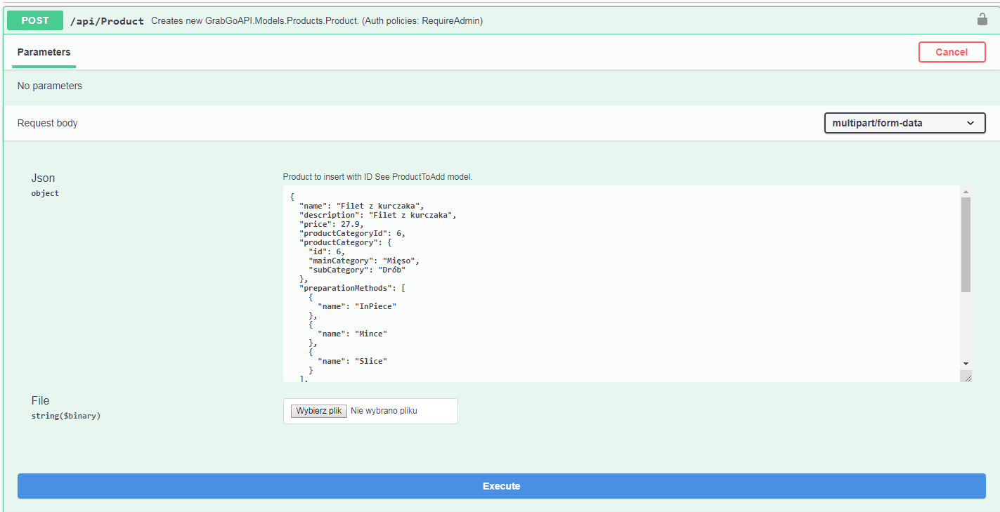

# Swashbuckle.AspNetCore.JsonMultipartFormDataSupport
Adds support for json in multipart/form-data requests.



# Usage

1. Simple add this to your `ConfigureServices`

```csharp
services.AddJsonMultipartFormDataSupport();
```

Or manually:

* Binder

```csharp
services
    .AddMvc(
        properties => {
            // ...
            properties.ModelBinderProviders.Insert(0, new FormDataJsonBinderProvider()); // Here
        }
    )
```

* Operation filter

```csharp
services.AddSwaggerGen(c => {
        c.OperationFilter<MultiPartJsonOperationFilter>();
    });
```

2. Add to your `Controller` 

```csharp
[HttpPost]
[Consumes("multipart/form-data")] 
public async Task<IActionResult> Post([FromForm] MultipartFormData<Product> multiPartData) {
    var file = multiPartData.File;
    var product = multiPartData.Json;
}
```

Or you can create your on wrapper

```csharp
public class MyWrapper {
    [FromJson] // <-- This attribute is required for binding.
    public MyModel Json { get; set; }

    public IFormFile File { get; set; }
}
```

and then
```csharp
[HttpPost]
[Consumes("multipart/form-data")] 
public async Task<IActionResult> Post([FromForm] MyWrapper myWrapper) {
    // code
}
```

Notes:

It automatically adds examples from class which implements `IExampleProvider<MyModel>`.
